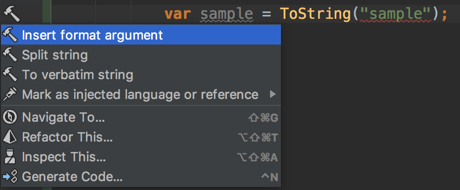
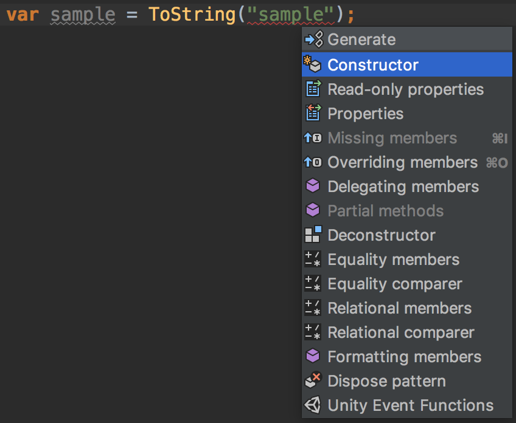

# 概略

ものすごくシンプルに言うと以下2つをしていれば Rider に必要な道具は揃っている

## 範囲選択して Alt + Enter

## 範囲選択してファイル右側

# 他ツール

## IdeaVim

Vim バインディングを使える拡張機能

.ideavimrc を記述すればvimrcライクにキーマッピングをかける

JetBeans 社の内部 vimmer が開発しているので、それなりに活発に更新もされている
