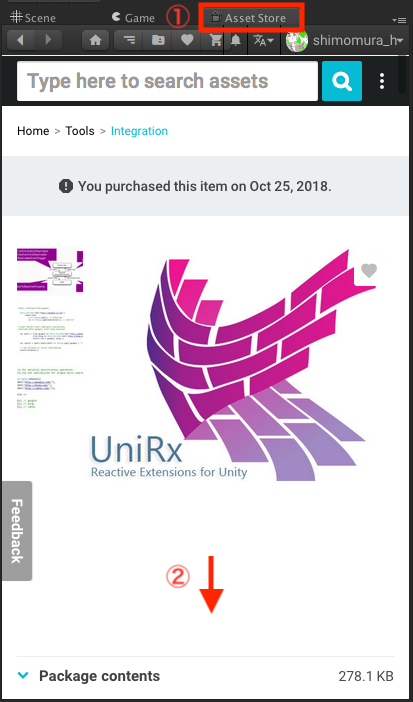
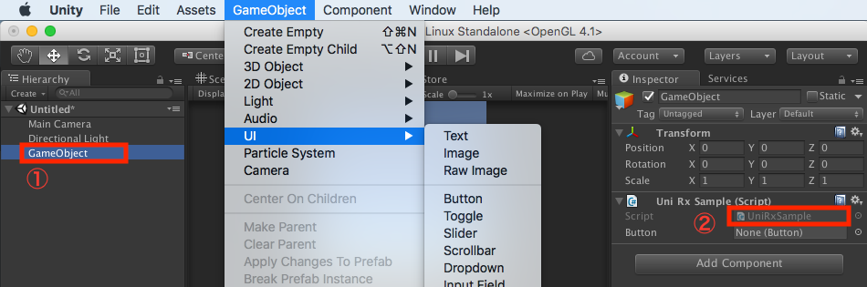
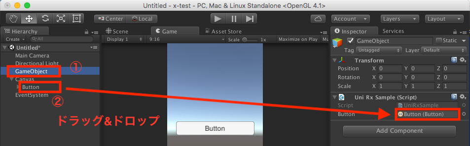

# UniRx の簡単なサンプルを実行して実装方法を知る

## UniRx のインストール

ライブラリのインストールは以下の通り。

Unity Editor 上の Asset Store のタブから UniRx を検索し、ページの下の方へスクロールすると、 Download のボタンがあるので、ダウンロード後、 Import のボタンに変わるので、 Import まで実行する。



## 簡単なコードの実行

```cs
using UnityEngine;
using System.Collections;

public class UniRxSample : MonoBehaviour
{
    private string[] messages = {"静かに！", "黙れ！"};
    private int speachCount = 0;

    #region LifeCycle

    void Awake()
    {
    }

    void Update()
    {
        if (Input.GetMouseButtonDown(0)) // 左クリックされたら
        {
            TellMessage(messages[speachCount++]);
        }
    }

    #endregion LifeCycle

    void TellMessage(string message)
    {
        Debug.Log("A: " + message);
        Debug.Log("B: " + message);
        Debug.Log("C: " + message);
    }
}
```

### ストーリーイメージ

あなたは先生で生徒A、B、Cに対してメッセージを伝えたい

### 実行結果

3回画面をタップすると、順にメッセージを吐き、3回目にはエラーを吐く。

```
A: 静かに！
B: 静かに！
C: 静かに！
A: 黙れ！
B: 黙れ！
C: 黙れ！
IndexoutOfRangeException: Array index is out of range.
```

## これを UniRx に書き換える

```cs
using UnityEngine;
using System.Collections;
using UniRx;

public class UniRxSample : MonoBehaviour
{
    private string[] messages = {"Please be quit!", "Shut up!"};
    private int speachCount = 0;
    private UniRx.Subject<string> subject = new UniRx.Subject<string>();

    #region LifeCycle

    void Awake()
    {
        // Cold Observerable を購読
        subject.Subscribe(message => TellMessage("A: " + message));
        subject.Subscribe(message => TellMessage("B: " + message));
        subject.Subscribe(message => TellMessage("C: " + message));
    }

    void Update()
    {
        if (Input.GetMouseButtonDown(0)) // 左クリックされたら
        {
            subject.OnNext(messages[speachCount++]);
        }
    }

    #endregion LifeCycle

    void TellMessage(string message)
    {
        Debug.Log(message);
    }
}
```

実行結果は先ほどと一緒だが、 Awake にて事前に順に生徒A、B、Cに言葉を伝えるという点が違う。

### オペレータを挟む

Do オペレータを使えば、言葉を発する前に動作をすることもできる

```cs
using UnityEngine;
using System.Collections;
using UniRx;

public class UniRxSample : MonoBehaviour
{
    private string[] messages = {"うるさい！", "だまれ！"};
    private int speachCount = 0;
    private UniRx.Subject<string> subject = new UniRx.Subject<string>();

    #region LifeCycle

    void Awake()
    {
        // Cold Observerable を購読
        subject.Do(_ => Feel(_)).Subscribe();
        subject.Do(_ => Watch("A")).Subscribe(message => TellMessage("A: " + message));
        subject.Do(_ => Watch("B")).Subscribe(message => TellMessage("B: " + message));
        subject.Do(_ => Watch("C")).Subscribe(message => TellMessage("C: " + message));
    }

    void Update()
    {
        if (Input.GetMouseButtonDown(0)) // 左クリックされたら
        {
            subject.OnNext(messages[speachCount++]);
        }
    }

    #endregion LifeCycle

    void TellMessage(string message)
    {
        Debug.Log(message);
    }

    void Feel(string message)
    {
        Debug.Log("ぽわわわわーん .oO (" + message + ")");
    }

    void Watch(string studentName)
    {
        Debug.Log(studentName + "と目を合わせて");
    }
}
```

#### 実行結果

```
ぽわわわわーん .oO (静かに！)
Aと目を合わせて
A: 静かに！
Bと目を合わせて
B: 静かに！
Cと目を合わせて
C: 静かに！
ぽわわわわーん .oO (黙れ！)
Aと目を合わせて
A: 黙れ！
Bと目を合わせて
B: 黙れ！
Cと目を合わせて
C: 黙れ！
IndexoutOfRangeException: Array index is out of range.
```

言葉を選ぶ想定で Where オペレータを使えば、特定の処理だけに絞ることもできる。

```cs
public class UniRxSample : MonoBehaviour
{
    private string[] messages = {"静かに！", "黙れ！"};
    private int speachCount = 0;
    private UniRx.Subject<string> subject = new UniRx.Subject<string>();

    #region LifeCycle

    void Awake()
    {
        // Cold Observerable を購読
        subject.Subscribe(_ => Debug.Log(speachCount + "回目のクリック"));
        subject.Where(message => message == "黙れ！").Subscribe(message => TellMessage("A: " + message));
        subject.Where(message => message == "黙れ！").Subscribe(message => TellMessage("B: " + message));
        subject.Where(message => message == "黙れ！").Subscribe(message => TellMessage("C: " + message));
    }

    void Update()
    {
        if (Input.GetMouseButtonDown(0)) // 左クリックされたら
        {
            subject.OnNext(messages[speachCount++]);
        }
    }

    #endregion LifeCycle

    void TellMessage(string message)
    {
        Debug.Log(message);
    }
}
```

#### 実行結果
```cs
1回目のクリック
A: 静かに！
B: 静かに！
C: 静かに！
2回目のクリック
IndexoutOfRangeException: Array index is out of range.
```

ちなみに、上記は全て IDisposable の寿命が書かれていないのでよろしくない（後述）。

## uGUI を UniRx で管理する

UniRx を使うメリットの中で特にコードの可読性の向上が見られるのが uGUI のボタンなどを Rx 化することである。

Inspector からボタンに関数登録することもできるが、これだと Script をみただけではどの関数が呼ばれるのかわからないため処理が追いにくい。

そこで [SerializeField] にしたボタンを Rx 化してあげれば何をしたいのかが明確になる。

```cs
using UnityEngine;
using UnityEngine.UI;
using System.Collections;
using UniRx;

public class UniRxSample : MonoBehaviour
{
    [SerializeField]
    private Button button;

    #region LifeCycle

    void Awake()
    {
        button.OnClickAsObservable()
            .Subscribe(_ => { Debug.Log("ボタンがクリックされたよ！"); }).AddTo(this.gameObject);
    }

    #endregion LifeCycle
}
```

この Script は 空の GameObject に付与されているだけだが、 SerializeField を定義したことで Button が Unity Editor の Inspector に表示されている。



そこで、新しく UI の Button を作成し、 **空の GameObject を選択した状態で** Button をドラッグ&ドロップすると、 Observable がハンドリングされる。



この状態で実行すると、ボタンクリック時に Debug.Log が測れるようになる。

#### 実行結果

```
ボタンがクリックされたよ！
```

ちなみに、この AddTo() メソッドによって、どのタイミングで IDisposable (Subject) の購読をやめるかを定義している。

ここでは UniRxSample の Script が付与された GameObject が破棄された時に IDisposable の購読も停止されることになる。

## 蛇足

ダブルクリックなどはかなり楽になるらしい

[未来のプログラミング技術をUnityで -UniRx-](https://www.slideshare.net/torisoup/unity-unirx)

## 参考

* [UniRxを使ってコードを見やすくする](https://uguisudani-media.com/unity/unirx/)
