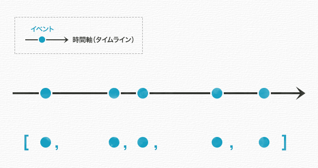
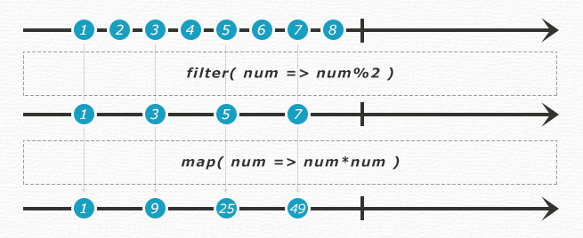
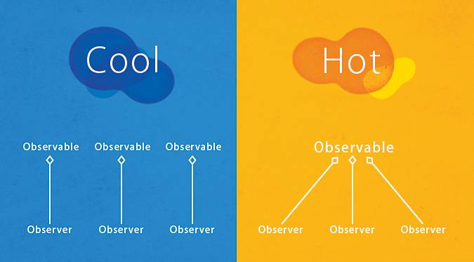

# Rx とは？

## 前提

引用元が RxJS なのは、作者が Web フロントエンド経験者で JS の方が理解しやすかったから。

## Rx is ReactiveX

Rx は C# 発のプロジェクト。

現在は、 Java, Javascript, Scala, C++, Ruby, Python, Groovy, JRuby, Kotlin などの様々な言語で移植開発されている。

## Rx が解決した課題 - 非同期処理

非同期処理には以下のような課題がある。

* 実行時間が保証されないため、大量に用いるとプログラムが錯綜しやすい
* 依存関係にある非同期処理の場合、ネストが深まり、いわゆる「コールバック地獄」になりがちでコードの可読性が下がる
* エラーハンドリングもしづらくなる

これらを解決する非同期処理支援ライブラリの一つという位置付け。

## Rx のデザインパターン

Rx は Observer パターンの考え方を取り入れつつ、イベントやデータをストリームとして扱えるような仕組みを導入することによって、プログラミングの柔軟性と可読性を飛躍的に向上させている。

## JS から学ぶ Rx 実装。

ここでは RxJS を扱うことにする。

コーディングについては学べませんが、イメージが湧くことが目的なので、作者が読みやすい RxJS で説明する。

### Rx っぽい処理でイメージを掴む

配列から filter する処理は Rx の処理の流れに似ている。

```javascript
[1, 2, 3, 4, 5, 6, 7, 8].filter(function(num){
  return num % 2;
});

// => [1, 3, 5, 7]
```

続いて、ボタンが Alt を押しながらクリックするとコンソールログを吐く処理を RxJS を使って書く。

```javascript
var btnClicks = Rx.Observable.fromEvent($('#btn'), "click");

btnClicks
  .filter(function (value) {
    return value.altKey;
  })
  .subscribe(function () {
    console.log('Altキーを押しながらクリックしたね！');
  });
```

処理の流れが似ているのがわかる。



イベントとは時間軸上に点在する離散的な「点」のことで、「配列のようにイベントを操作できる」という点が可読性向上に貢献している。

さっきの例でやったことは、ボタンの「クリックイベントの配列」に対して、filter()メソッドを適用し、その結果、クリック時に「altが押されているイベント」だけが残った新しい「イベントの配列」が生成されるということである。

出来上がった新しい「イベントの配列」を一個ずつ取り出すためには、subscribe（購読）を行う必要があるので、 subscribe メソッドを使って値を出力したということにすぎない。

大まかなプロセスは以下の通り。

イベントが発生　—>　filter()を通り　—>　テストに合格したイベントでできた新しいイベントの配列の誕生 —> 購読者に通知する

### Stream

上記で説明していた「イベントの配列」のことを Rx では「Stream」と表現する。

Stream とは「水の流れ、小川」という意味なので、タイムラインという川を「イベント（データ、値）」が流れていくとイメージすると理解しやすい。


### オペレーションチェーンとそれぞれが返す値

JS で考えると、メソッドチェーンが Rx のオペレーションチェーンにあたる。

```javascript
[1, 2, 3, 4, 5, 6, 7, 8]
.filter(function (num) {
  return num % 2;
})
.map(function (num) {
  return num * num;
});

// => [1, 9, 25, 49]
```

これを Rx で表現すると以下のようになる。

```javascript
Rx.Observable.from([1, 2, 3, 4, 5, 6, 7, 8]) // 配列をストリーム(Observable)に変換
  .filter(function (num) { //戻り値：Observable
    return num % 2;
  }).map(function (num) { // 戻り値：Observable
    return num * num;
  }).forEach(function (num) {  // `forEach`は`subscribe`のエイリアス。戻り値：Diposable
    return console.log(num);
  });

// => 1
// => 9
// => 25
// => 49
```

この処理でのポイントは

* コメントアウトしている通り、通知したい内容（配列）をストリーム（Observable）に変換している点
* Operator の戻り値はストリーム（Observable）という点

である。



このように図解したものを Marble Diagrams と呼び、オペレーターの理解に役立つ。

次は、それぞれの値を500ミリ秒ごとに吐き出すように変えた例を示す。

```javascript
// `subscribe()`に渡すためのobserverを作成する。
var observer = Rx.Observer.create(function (num) {
  // 新しい値がプッシュされたときに
  return console.log("onNext: " + num);
}, function (error) {
  // エラーが起きたときに
  return console.log("onError: " + error);
}, function () {
  // 全ての値をプッシュし、ストリームが終了したときに
  return console.log('onCompleted');
});

Rx.Observable.from([1, 2, 3, 4, 5, 6, 7, 8])
  // 一要素ごとに500ミリ秒ずらす
  .delayWithSelector(function (num) {
    return Rx.Observable.timer(num * 500);
  }).filter(function (num) {
    return num % 2;
  }).map(function (num) {
    return num * num;
  }).subscribe(observer);


// => onNext: 1
// => onNext: 9
// => onNext: 25
// => onNext: 49
// => onCompleted
```

ポイントは以下の通り

* Observer には「通知」が来た時にどうするかが記述されている
* Observable は「ストリーム」なのでイベントの流れが記述されており、最後の subscribe で実行して Disposable を返している

ちなみに、subscribe の引数として observer 以外に Observer で定義したコールバックをそれぞれ引数として与えることもできる

```javascript
var onNext = function(){}; // プッシュ時のコールバック
var onError = function(){}; // エラー時のコールバック
var onCompleted = function(){}; // 完了時のコールバック

observable.subscribe( onNext, onError, onCompleted );
```

### Observer と Observable

それぞれの関係をコーディングを参考に示す。

以下は500ミリ秒ずつログが出力され、5秒後にログの出力が止まるスクリプトである。

```javascript
var source = Rx.Observable.create(function (observer) {
  // `onNext`を使って、`num`を500ミリ秒ずつobserverにプッシュする
  var num = 0;
  var id = setInterval(function () {
    observer.onNext(num++);
  }, 500);

  setTimeout(function () {
    // 10秒後に、「ストリームが完了した」合図を送る
    observer.onCompleted();
  }, 10000);

  // もちろん、尻ぬぐいの手段を提供しないとダメです
  return function () {
    console.log('disposed');
    clearInterval(id);
  };
});

var subscription = source.subscribe(
  function (x) {
    console.log('onNext: ' + x);
  },
  function (e) {
    console.log('onError: ' + e.message);
  },
  function () {
    console.log('onCompleted');
  });

setTimeout(function () {
  subscription.dispose();
}, 5000);

// => onNext: 0
// => onNext: 1
// => onNext: 2
// => onNext: 3
// => onNext: 4
// => onNext: 5
// => onNext: 6
// => onNext: 7
// => onNext: 8
// => disposed
```

### Cold vs Hot

図でみれば一目でわかる。



Cold と Hot については [UniRx とは？](../wiki/unirx_tutorial.md) にて細かくコードを用いて説明しているのでそちらで補完してほしい。

## 引用元

* [「RxJS」初心者入門 – JavaScriptの非同期処理の常識を変えるライブラリ](https://liginc.co.jp/web/js/151272)
