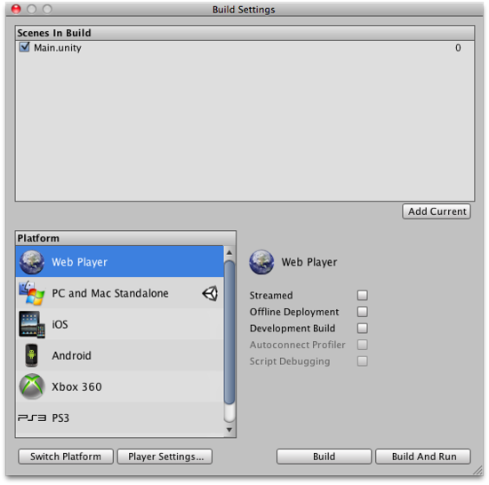

# Unity で一番最初に起動されるものは？

Unity Editor 上の [◁] (Run) ボタンを押した場合は、現在の Scene が起動する

ビルドされたアプリケーションファイルの場合は Build Settings で Index に 0 が割り当てられた Scene が起動する

## 参考

* [ビルドの公開 - Unity マニュアル](https://docs.unity3d.com/jp/460/Manual/PublishingBuilds.html)
